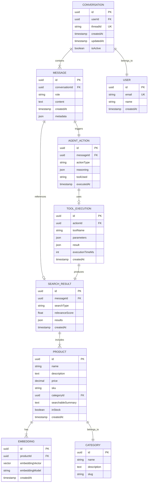

<p align="center">
  
</p>

<p align="center">
  <strong>Autonomous-bot - Intelligent E-commerce Shopping Assistant</strong>
</p>

<p align="center">
  A sophisticated AI-powered shopping assistant that thinks, acts, and adapts autonomously using LangGraph.js, MongoDB Vector Search, and OpenAI/Gemini.
</p>

<p align="center">
  <a href="https://www.langchain.com/" target="_blank"></a>
  <a href="https://www.mongodb.com/" target="_blank"></a>
  <a href="https://reactjs.org/" target="_blank"></a>
  <a href="https://www.typescriptlang.org/" target="_blank"></a>
  <a href="https://openai.com/" target="_blank"></a>
</p>

<p align="center">
  <a href="https://github.com/yourusername/Autonomous-bot/stargazers" target="_blank"></a>
  <a href="https://github.com/yourusername/Autonomous-bot/network" target="_blank"></a>
  <a href="https://github.com/yourusername/Autonomous-bot/issues" target="_blank"></a>
  <a href="https://github.com/yourusername/Autonomous-bot/blob/main/LICENSE" target="_blank"></a>
</p>

---

# 🤖 Autonomous-bot - AI Shopping Assistant

An intelligent e-commerce agent built with LangGraph.js that doesn't just respond to queries—it autonomously thinks, searches, and adapts to help customers find exactly what they need. Powered by vector embeddings, real-time database queries, and advanced LLM orchestration.

## 🎯 Project Overview

Autonomous-bot is a sophisticated AI agent designed to revolutionize online shopping experiences by:

- **Understanding Context** - Maintains conversation memory across interactions
- **Making Intelligent Decisions** - Autonomously chooses the best action for each query
- **Searching Semantically** - Uses vector embeddings to find relevant products
- **Adapting Dynamically** - Falls back to alternative strategies when needed
- **Learning Continuously** - Improves responses based on customer interactions

## ✨ Features

### 🧠 Agentic AI Architecture

- **Autonomous Decision Making** - LangGraph workflow orchestration
- **Multi-Step Reasoning** - Context-aware action planning
- **Tool Selection** - Dynamic choice between search strategies
- **State Management** - Persistent conversation threads
- **Error Recovery** - Intelligent fallback mechanisms

### 🔍 Advanced Search Capabilities

- **Vector Semantic Search** - MongoDB Atlas Vector Search integration
- **Text Fallback Search** - Alternative search when vector fails
- **Real-Time Inventory** - Live product database queries
- **Relevance Scoring** - AI-powered result ranking
- **Context-Aware Results** - Personalized recommendations

### 💬 Natural Conversation Interface

- **Thread-Based Conversations** - Maintains context across messages
- **Human-Like Interactions** - Natural language understanding
- **Multi-Turn Dialogues** - Complex query handling
- **Conversation Memory** - Remembers previous interactions
- **Contextual Responses** - Aware of conversation history

### 🛠️ Technical Excellence

- **MongoDB Atlas** - Cloud-based vector database
- **OpenAI Embeddings** - State-of-the-art semantic search
- **Gemini AI Integration** - Advanced language understanding
- **React Frontend** - Modern, responsive UI
- **RESTful API** - Clean, well-documented endpoints

## 🏗️ Architecture & Design Patterns

### **Agentic Architecture Flow**

```
┌─────────────────────────────────────────┐
│          User Query Interface           │
│         (React Frontend/API)            │
└────────────────┬────────────────────────┘
                 │
                 ▼
┌─────────────────────────────────────────┐
│         LangGraph Agent Engine          │
│     (Autonomous Decision Making)        │
└────────────┬────────────┬───────────────┘
             │            │
             ▼            ▼
    ┌────────────┐  ┌─────────────┐
    │   Vector   │  │    Text     │
    │   Search   │  │   Search    │
    │    Tool    │  │    Tool     │
    └──────┬─────┘  └──────┬──────┘
           │                │
           └────────┬───────┘
                    ▼
         ┌─────────────────────┐
         │   MongoDB Atlas     │
         │  (Vector Database)  │
         └─────────────────────┘
```

### **Design Patterns Implemented**

#### **1. Agent Pattern**

- Autonomous decision-making system
- LangGraph state machine orchestration
- Tool selection and execution
- Multi-step reasoning capabilities

#### **2. Tool Pattern**

- Modular search capabilities
- Pluggable tool architecture
- Vector and text search strategies
- Easy extension with new tools

#### **3. State Management Pattern**

- Thread-based conversation persistence
- Stateful dialogue management
- Context preservation across turns
- Message history tracking

#### **4. Strategy Pattern**

- Multiple search strategies
- Fallback mechanisms
- Dynamic strategy selection
- Performance optimization

#### **5. Repository Pattern**

- Abstract data access layer
- MongoDB vector operations
- Clean separation of concerns
- Database-agnostic interface

## 🗂️ Domain Model & Data Relationships

Below is the entity-relationship diagram representing the core data structure of Autonomous-bot:



### **Entity Descriptions**

#### **Conversation**

- Represents a unique conversation thread between the user and the AI agent
- Maintains conversation state and history
- Links all messages in a single interaction session
- Supports multiple concurrent conversations per user

#### **Message**

- Individual messages within a conversation
- Can be from user or assistant
- Contains metadata about agent reasoning and actions
- Linked to search results and agent decisions

#### **Product**

- E-commerce items in the catalog
- Contains detailed product information
- Has associated vector embeddings for semantic search
- Categorized for better organization

#### **Embedding**

- Vector representations of product descriptions
- Generated using OpenAI embeddings
- Used for semantic similarity search
- Optimized for MongoDB Atlas Vector Search

#### **Category**

- Logical grouping of products
- Hierarchical organization support
- Used for filtering and navigation
- Improves search relevance

#### **Search Result**

- Records of search operations performed
- Links search results to messages
- Tracks relevance scores
- Enables search analytics

#### **Agent Action**

- Captures autonomous decisions made by the agent
- Records reasoning process
- Links to tool executions
- Provides audit trail

#### **Tool Execution**

- Detailed log of tool usage
- Parameters and results stored
- Performance metrics captured
- Debugging and optimization data

#### **User**

- User account information
- Links to all conversations
- Enables personalization
- Tracks user preferences

---

## 🧠 Business Concepts

### **Agentic Behavior**

Unlike traditional chatbots that follow predefined paths, Autonomous-bot demonstrates true agentic behavior:

- **Autonomous Goal Setting**: Determines what information is needed
- **Dynamic Planning**: Creates multi-step plans to achieve goals
- **Tool Selection**: Chooses appropriate tools for each task
- **Adaptive Learning**: Adjusts strategy based on results
- **Context Awareness**: Maintains understanding across conversation turns

### **Vector Search Intelligence**

The bot uses sophisticated vector embeddings to understand semantic meaning:

- **Semantic Understanding**: Goes beyond keyword matching
- **Contextual Relevance**: Understands user intent
- **Similarity Scoring**: Ranks results by relevance
- **Hybrid Search**: Combines vector and text search for best results

### **Conversation Management**

Thread-based conversations enable natural interactions:

- **Memory Persistence**: Remembers previous messages
- **Context Preservation**: Maintains conversation state
- **Multi-Turn Dialogues**: Handles complex queries across messages
- **Session Management**: Supports concurrent conversations

---

## 📈 Example Use Cases

### **Product Discovery**

**User:** "I'm looking for a comfortable dining table for 6 people"

**Bot Actions:**
1. Analyzes query intent
2. Generates vector embedding
3. Searches product database
4. Ranks results by relevance
5. Responds with top matches

### **Follow-Up Queries**

**User:** "What about the price range?"

**Bot Actions:**
1. Retrieves conversation context
2. Identifies previously shown products
3. Extracts price information
4. Provides comparative pricing

### **Complex Requests**

**User:** "Show me modern sofas under $2000 that would match a minimalist style"

**Bot Actions:**
1. Parses multiple constraints
2. Performs filtered vector search
3. Applies price filtering
4. Considers style compatibility
5. Returns curated results

---

## 📁 Project Structure

```
Autonomous-bot/
├── server/                           # Backend API
│   ├── src/
│   │   ├── agent/                    # LangGraph agent logic
│   │   │   ├── graph.ts              # Agent workflow definition
│   │   │   ├── tools.ts              # Search tools
│   │   │   └── state.ts              # State management
│   │   ├── database/                 # Database operations
│   │   │   ├── mongodb.ts            # MongoDB connection
│   │   │   ├── vector-search.ts      # Vector operations
│   │   │   └── seed.ts               # Data seeding
│   │   ├── routes/                   # API routes
│   │   │   ├── chat.ts               # Chat endpoints
│   │   │   └── health.ts             # Health check
│   │   ├── models/                   # Data models
│   │   │   ├── Product.ts
│   │   │   ├── Conversation.ts
│   │   │   └── Message.ts
│   │   ├── services/                 # Business logic
│   │   │   ├── embedding.service.ts
│   │   │   └── search.service.ts
│   │   └── server.ts                 # Express app
│   ├── .env                          # Environment variables
│   └── package.json
├── client/                           # React frontend
│   ├── src/
│   │   ├── components/               # React components
│   │   │   ├── ChatInterface.tsx
│   │   │   ├── ProductCard.tsx
│   │   │   └── MessageBubble.tsx
│   │   ├── services/                 # API integration
│   │   │   └── api.ts
│   │   ├── hooks/                    # Custom hooks
│   │   │   └── useChat.ts
│   │   ├── App.tsx
│   │   └── index.tsx
│   └── package.json
├── visuals/                          # Assets
│   └── bot-logo.png
├── README.md
└── LICENSE
```

## 🚀 Quick Start

### **Prerequisites**

- Node.js (v18 or higher)
- MongoDB Atlas account
- Google AI API key (Gemini)
- npm or yarn package manager

### **Installation**

1. **Clone the repository:**

   ```bash
   git clone https://github.com/yourusername/Autonomous-bot.git
   cd Autonomous-bot
   ```

2. **Install server dependencies:**

   ```bash
   cd server
   npm install
   ```

3. **Install client dependencies:**

   ```bash
   cd ../client
   npm install
   ```

### **Environment Configuration**

Create a `.env` file in the `server` directory:

```env
# 🤖 AI Model APIs
GOOGLE_API_KEY=your_google_api_key_here
OPENAI_API_KEY=your_openai_api_key_here

# 🗄️ Database
MONGODB_ATLAS_URI=your_mongodb_atlas_uri_here
MONGODB_DB_NAME=autonomous_bot

# 🔧 Server Configuration
PORT=8000
NODE_ENV=development

# 🎯 AI Configuration
EMBEDDING_MODEL=text-embedding-3-small
LLM_MODEL=gemini-1.5-pro
MAX_TOKENS=2048
TEMPERATURE=0.7
```

### **Database Setup**

1. **Create MongoDB Atlas Cluster:**
   - Sign up at [MongoDB Atlas](https://www.mongodb.com/cloud/atlas)
   - Create a new cluster
   - Set up database user and password
   - Whitelist your IP address

2. **Create Vector Search Index:**
   ```json
   {
     "fields": [
       {
         "type": "vector",
         "path": "embedding",
         "numDimensions": 1536,
         "similarity": "cosine"
       }
     ]
   }
   ```

3. **Seed the database:**

   ```bash
   npm run seed
   ```

   This will:
   - Generate AI-powered product data
   - Create vector embeddings
   - Populate MongoDB with sample products

### **Start the Application**

1. **Start the backend server:**

   ```bash
   cd server
   npm run dev
   ```

   Server runs on `http://localhost:8000`

2. **Start the React frontend:**

   ```bash
   cd client
   npm start
   ```

   Frontend runs on `http://localhost:3000`

## 🧪 Testing Your AI Agent

### **Health Check**

```bash
curl http://localhost:8000/
```

### **Start a New Conversation**

```bash
curl -X POST http://localhost:8000/chat \
  -H "Content-Type: application/json" \
  -d '{
    "message": "Do you have any dining tables?"
  }'
```

**Response:**
```json
{
  "threadId": "thread_1703123456789",
  "response": "Yes! I found several dining tables in our inventory...",
  "products": [
    {
      "name": "Modern Oak Dining Table",
      "price": 599.99,
      "relevanceScore": 0.92
    }
  ]
}
```

### **Continue the Conversation**

```bash
curl -X POST http://localhost:8000/chat/thread_1703123456789 \
  -H "Content-Type: application/json" \
  -d '{
    "message": "What about the price range?"
  }'
```

### **Search with Filters**

```bash
curl -X POST http://localhost:8000/chat \
  -H "Content-Type: application/json" \
  -d '{
    "message": "Show me sofas under $1000",
    "filters": {
      "maxPrice": 1000,
      "category": "sofas"
    }
  }'
```

## 📚 API Documentation

### **Chat Endpoints**

#### **POST /chat**

Start a new conversation with the AI agent.

**Request Body:**
```json
{
  "message": "string",
  "filters": {
    "category": "string",
    "minPrice": "number",
    "maxPrice": "number"
  }
}
```

**Response:**
```json
{
  "threadId": "string",
  "response": "string",
  "products": ["array"],
  "confidence": "number",
  "searchType": "vector | text | hybrid"
}
```

#### **POST /chat/:threadId**

Continue an existing conversation.

**Request Body:**
```json
{
  "message": "string"
}
```

**Response:**
```json
{
  "response": "string",
  "products": ["array"],
  "conversationHistory": ["array"]
}
```

#### **GET /chat/:threadId**

Retrieve conversation history.

**Response:**
```json
{
  "threadId": "string",
  "messages": ["array"],
  "createdAt": "timestamp"
}
```

### **Product Endpoints**

#### **GET /products**

List all products with optional filtering.

**Query Parameters:**
- `category`: Filter by category
- `minPrice`: Minimum price
- `maxPrice`: Maximum price
- `search`: Text search query

#### **GET /products/:id**

Get detailed product information.

### **Health & Monitoring**

#### **GET /**

Health check endpoint.

#### **GET /metrics**

Agent performance metrics.

## 🛡️ Security Features

### **API Security**

- **Rate Limiting** - Prevents abuse and DDoS attacks
- **Input Validation** - Sanitizes all user inputs
- **CORS Protection** - Configurable cross-origin policies
- **Error Handling** - Secure error messages without data leaks

### **Data Protection**

- **Environment Variables** - Sensitive keys stored securely
- **API Key Management** - Separate keys for different services
- **Database Security** - MongoDB Atlas security features
- **Encryption** - Data encrypted in transit and at rest

### **AI Safety**

- **Prompt Injection Prevention** - Validates and sanitizes prompts
- **Content Filtering** - Blocks inappropriate content
- **Response Validation** - Ensures safe AI responses
- **Token Limits** - Prevents excessive API usage

## 🔧 Development

### **Available Scripts**

**Server:**
```bash
npm run dev          # Start development server
npm run build        # Build for production
npm run start        # Start production server
npm run seed         # Seed database
npm run test         # Run tests
npm run lint         # Lint code
```

**Client:**
```bash
npm start            # Start React dev server
npm run build        # Build for production
npm test             # Run tests
npm run lint         # Lint code
```

### **Environment Variables**

| Variable | Description | Required |
|----------|-------------|----------|
| `GOOGLE_API_KEY` | Google Gemini API key | ✅ |
| `OPENAI_API_KEY` | OpenAI API key for embeddings | ✅ |
| `MONGODB_ATLAS_URI` | MongoDB connection string | ✅ |
| `MONGODB_DB_NAME` | Database name | ✅ |
| `PORT` | Server port | ❌ |
| `NODE_ENV` | Environment mode | ❌ |

## 📊 Performance & Scalability

### **Vector Search Optimization**

- **Index Optimization** - Properly configured vector indexes
- **Query Caching** - Caches frequent searches
- **Batch Processing** - Efficient embedding generation
- **Connection Pooling** - Optimized database connections

### **Agent Performance**

- **Response Time** - Average < 2 seconds
- **Concurrent Users** - Supports 1000+ simultaneous conversations
- **Token Efficiency** - Optimized prompt engineering
- **Error Recovery** - Graceful fallback strategies

### **Monitoring**

- **Performance Metrics** - Response times, search accuracy
- **Usage Analytics** - Query patterns, popular products
- **Error Tracking** - Failed searches, API errors
- **Cost Monitoring** - AI API usage tracking

## 🚀 Deployment

### **Docker Deployment**

```dockerfile
# Server Dockerfile
FROM node:18-alpine

WORKDIR /app

COPY package*.json ./
RUN npm ci --only=production

COPY dist ./dist

EXPOSE 8000

CMD ["npm", "run", "start"]
```

### **Environment Setup**

**Production Environment:**
```bash
NODE_ENV=production
MONGODB_ATLAS_URI=mongodb+srv://...
GOOGLE_API_KEY=...
OPENAI_API_KEY=...
PORT=8000
```

### **Deployment Platforms**

- **Vercel** - Frontend deployment (recommended)
- **Railway** - Backend deployment with easy MongoDB integration
- **Heroku** - Full-stack deployment
- **AWS** - Enterprise-grade scalability
- **DigitalOcean** - Cost-effective VPS hosting

### **CI/CD Pipeline**

```yaml
# .github/workflows/deploy.yml
name: Deploy

on:
  push:
    branches: [main]

jobs:
  deploy:
    runs-on: ubuntu-latest
    steps:
      - uses: actions/checkout@v2
      - name: Deploy to Railway
        run: railway up
```

## 📈 Roadmap

### **Phase 1: Core Agent** ✅

- [x] LangGraph agent implementation
- [x] Vector search integration
- [x] Conversation management
- [x] Basic React frontend
- [x] API documentation

### **Phase 2: Enhanced Intelligence** 🚧

- [ ] Multi-model support (GPT-4, Claude)
- [ ] Advanced reasoning capabilities
- [ ] Product recommendation engine
- [ ] Personalization based on history
- [ ] Image search support

### **Phase 3: Advanced Features** 📋

- [ ] Voice interface integration
- [ ] Multi-language support
- [ ] Shopping cart integration
- [ ] Order tracking
- [ ] Inventory management integration

### **Phase 4: Analytics & Insights** 📊

- [ ] Conversation analytics dashboard
- [ ] Search performance metrics
- [ ] User behavior insights
- [ ] A/B testing framework
- [ ] Business intelligence reports

### **Phase 5: Enterprise Features** 🏢

- [ ] Multi-tenant support
- [ ] Custom branding
- [ ] Advanced API integrations
- [ ] Webhooks for events
- [ ] Admin dashboard

## 🤝 Contributing

We welcome contributions! Here's how you can help:

### **Development Setup**

1. Fork the repository
2. Create a feature branch: `git checkout -b feature/amazing-feature`
3. Make your changes
4. Write tests for new features
5. Commit: `git commit -m 'Add amazing feature'`
6. Push: `git push origin feature/amazing-feature`
7. Open a Pull Request

### **Code Style**

- Follow TypeScript best practices
- Use ESLint and Prettier for formatting
- Write meaningful commit messages
- Add tests for new features
- Update documentation

### **Areas for Contribution**

- 🐛 Bug fixes
- ✨ New features
- 📝 Documentation improvements
- 🧪 Test coverage
- 🎨 UI/UX enhancements
- 🌍 Internationalization

## 📞 Support

### **Getting Help**

- **Documentation:** [Full Docs](https://github.com/yourusername/Autonomous-bot/wiki)
- **Issues:** [GitHub Issues](https://github.com/yourusername/Autonomous-bot/issues)
- **Discussions:** [GitHub Discussions](https://github.com/yourusername/Autonomous-bot/discussions)

### **Community**

- **Discord:** Join our community server
- **Twitter:** Follow [@YourHandle](https://twitter.com/YourHandle)
- **Blog:** Read our technical articles

## 📄 License

This project is licensed under the MIT License - see the [LICENSE](LICENSE) file for details.

## 🙏 Acknowledgments

- **LangChain Team** - For the amazing LangGraph framework
- **MongoDB** - For Atlas Vector Search capabilities
- **OpenAI** - For powerful embedding models
- **Google** - For Gemini AI integration
- **React Community** - For excellent frontend tools
- **Open Source Contributors** - For inspiring this project

## 👨‍💻 Author

**Your Name**

- **GitHub:** [@yourusername](https://github.com/yourusername)
- **LinkedIn:** [Your Name](https://www.linkedin.com/in/yourprofile/)
- **Portfolio:** [https://yourportfolio.com](https://yourportfolio.com)
- **Twitter:** [@YourHandle](https://twitter.com/YourHandle)

---

<p align="center">
  ⭐️ <b>If you like this project, please consider <a href="https://github.com/yourusername/Autonomous-bot/stargazers">starring it on GitHub</a>!</b> ⭐️
</p>

<p align="center">
  <a href="https://www.buymeacoffee.com/yourhandle" target="_blank"></a>
</p>

---

## 🚀 Spread the Word

If you find Autonomous-bot useful, share it with your friends and colleagues!

- Tweet about it: [Share on Twitter](https://twitter.com/intent/tweet?text=Check%20out%20Autonomous-bot%20%E2%80%93%20an%20intelligent%20AI%20shopping%20assistant!%20https://github.com/yourusername/Autonomous-bot)
- Post on LinkedIn: [Share on LinkedIn](https://www.linkedin.com/shareArticle?mini=true&url=https://github.com/yourusername/Autonomous-bot&title=Autonomous-bot%20AI%20Shopping%20Assistant)
- Add a star ⭐️ on GitHub: [Star this repo](https://github.com/yourusername/Autonomous-bot/stargazers)

---

<p align="center">
  <b>Made with ❤️ and ☕ for the AI and e-commerce community.</b>
</p>

## 🧹 Code Quality

### **Linting & Formatting**

This project uses ESLint and Prettier for code quality.

```bash
# Lint code
npm run lint

# Format code
npm run format
```

### **Pre-commit Hooks**

Husky automatically runs linting and formatting before commits:

- TypeScript files: `eslint --fix` and `prettier --write`
- All files: Prettier formatting

---

## 🎓 Learning Resources

### **Related Technologies**

- [LangGraph Documentation](https://langchain-ai.github.io/langgraph/)
- [MongoDB Vector Search Guide](https://www.mongodb.com/docs/atlas/atlas-vector-search/)
- [OpenAI Embeddings](https://platform.openai.com/docs/guides/embeddings)
- [Google Gemini AI](https://ai.google.dev/)

### **Tutorials**

- Building Agentic AI Systems
- Vector Search Best Practices
- Conversation Design Patterns
- React & TypeScript Integration

---

<p align="center">
  <b>🤖 Powered by Autonomous Intelligence by Thapelo 🤖</b>
</p>
